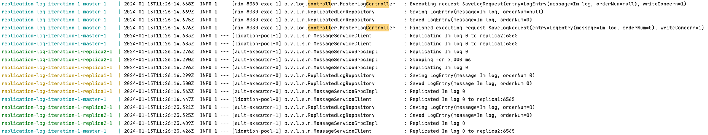
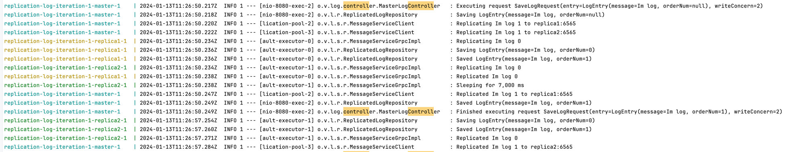
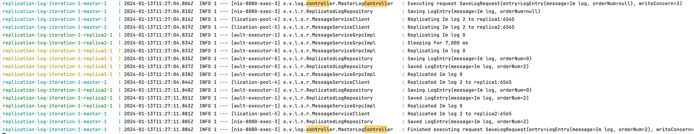

# replicated-log iteration 2
## Requirements

In the previous iteration, the replication was blocking for all secondaries, i.e. to return a response to the client we should receive acknowledgements (ACK) from all secondaries.


Current iteration should provide tunable semi-synchronicity for replication, by defining write concern parameters. </br>
client POST request in addition to the message should also contain write concern parameter w=1,2,3,..,n </br>
w value specifies how many ACKs the master should receive from secondaries before responding to the client:
* w = 1 - only from master
* w = 2 - from master and one secondary
* w = 3 - from master and two secondaries

Please emulate the replica’s inconsistency (and eventual consistency) with the master by introducing the artificial delay on the secondary node. In this case, the master and secondary should temporarily return different lists of messages. </br>
Add logic for messages deduplication and to guarantee the total ordering of messages. </br>


## Development
Replication is reworked to be asynchronous, to see implementation check [ReplicatedLogRepository](src/main/java/org/vkartashov/log/repository/ReplicatedLogRepository.java) </br>
To release request execution thread, Countdown latch is used.</br>

Ordering number has been introduced to ensure correct ordering on replicas. All log entries are put into TreeSet with ordering through order number. </br>
## How to run
Java 17 is required to be installed on local environment </br>
Run with command for Mac/Linux:
```bash
./up.sh
```

## Results
MasterLogController is entry point for handling append log entry request.</br>
As we see thread is released straight away and message is replicated in background</br>
Write concern 1. As we see thread is released straight away and message is replicated in background.</br>

Write concern 2. Thread is released after one of replications has been done. Other replica is artificially delayed for 7 sec.

Write concern 3. Thread is released after both replications are done.
