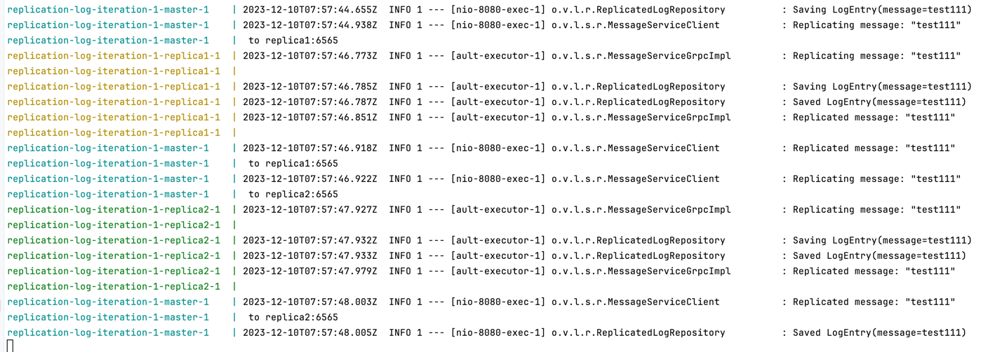

# replicated-log iteration 1
## Requirements
The Replicated Log should have the following deployment architecture: one Master and any number of Secondaries.

Master should expose a simple HTTP server (or alternative service with a similar API) with: <br/>
POST method - appends a message into the in-memory list <br/>
GET method - returns all messages from the in-memory list <br/>

Secondary should expose a simple  HTTP server(or alternative service with a similar API)  with: <br/>
GET method - returns all replicated messages from the in-memory list <br/>

Properties and assumptions: <br/>
* after each POST request, the message should be replicated on every Secondary server <br/>
* Master should ensure that Secondaries have received a message via ACK <br/>
* Master’s POST request should be finished only after receiving ACKs from all Secondaries (blocking replication approach) <br/>
* to test that the replication is blocking, introduce the delay/sleep on the Secondary <br/>
* at this stage assume that the communication channel is a perfect link (no failures and messages lost) <br/>
* any RPC framework can be used for Master-Secondary communication (Sockets, language-specific RPC, HTTP, Rest, gRPC, …)<br/>
* your implementation should support logging <br/>
* Master and Secondaries should run in Docker<br/>

## Development
Java 17, Spring Boot and GRPC have been used for this task </br>
Server API calls are done through REST, internal communication is done through GRPC </br>
Configuration of each node is defined by application.properties file: 
```
replication-log.is-replica=false
replication-log.replicas=localhost:6566,localhost:6567
```

## How to run
Java 17 is required to be installed on local environment </br>
Run with command for Mac/Linux:
```bash
./up.sh
```

## Results
As per image below - master request is not finished until message is replicated on all replicas
